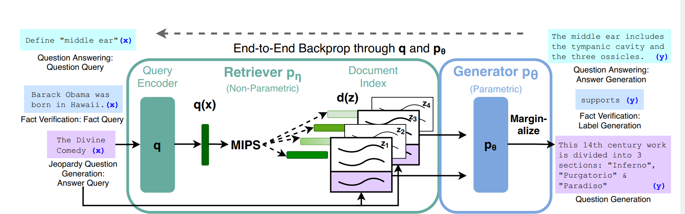

This article delves deep into the foundational mechanisms of RAG.

>[!TIP] Analogy about RAG
>Imagine a journalist, wanting to write about a specific topic, goes to the library for research. 
>The library is an expert in retrieving books, so after reading the query from the journalist, he sorts out the relevant books and hands them to the journalist, based on which the journalist produces the article.
>**In short, RAG is the cooperation between retriever and generator. **

## SPL& CPL: LLMs on knowledge-intensive tasks

#### Problems with previous LLMs
1. LLMs are unable to update their knowledge automatically
2. LLMs tend to produce hallucinations, especially when answering discipline-related questions that require research for humans

#### Previous attempts: REALM and ORQA

REALM and ORQA both are hybrid models with both **parametric Memory** (knowledge embedded in the weight matrices of the model themselves) and **Non-parametric Memory** (memory that can be accessed and modified outside of the model)

They are also built with a **Differentiable Retriever**, which can be trained through backprop

However, **REALM and ORQA** utilizes **Masked LMs like BERT,** which are only capable of **extractive question answering (extracting spans of text from the external knowledge as answers)**, and thereby unable to generate novel answers by integrating several documents together.

## WTD: principles of RAG

#### Simply explained
[Vivid explanation of RAG by IBM](https://www.youtube.com/watch?v=qppV3n3YlF8)

The whole RAG process can be divided into three phrases: **Indexing, Retrieval and Generation**

#### Indexing: converting documents into vector databases

This is done by three operations:
1. **Chunking:**  Long documents are divided into many chunks at a fixed length without overlap. For example, in this dissertation, every chunk consists of 100 words.
2. **Embedding:** encode every chunk `z` as a high-dimensional vector `d(z)` that catches the semantic meaning of the chunk. This is implemented through a pre-trained **Document encoder**, like `BERT_d` in this paper.
3. **Index building:** storing all chunk vectors as a vector database that can be retrieved efficiently. In this dissertation, the process is facilitated with the **FAISS Library**([Facebook AI Similarity Search](https://github.com/facebookresearch/faiss))

#### Retrieval

Upon a Use query `x`, RAG extracts the Top-K relevant chunks from the vector database
The query stands for the whole prompt given to AI.

1. **Query Encoding:** A query encoder (`BERT_q` based on `BERT`) encodes the query `x` into a vector `q(x)` 
2. **Similarity Calculation:** The mathematical representation of **Relevance** is the **Dot product between `q(x)` and `d(z)`**, so the model does a **Maximum Inner Product Search ( MIPS )** to select the TOP-K relevant chunk vectors. 
   Mathematically Speaking, $p_\eta(z|x)\propto exp(d(z)^T q(x))$
   To speed up the retrieval process, an algorithm called **Hierarchical Navigable Small World** is employed in **FAISS**, which completes an approximate search in nearly linear time complexity

#### Generation

**How does the extracted chunk facilitate in generating the final answer?**

- **Concatenation:** RAG first concatenates every extracted chunk `z_i` with the query `x` to form pairs like ``[x,z1], [x,z2], [x,z3] ...``
- **Weighted Generation:** The pre-trained generator `BART` outputs the answer by taking the weighted average over all retrieved contents

#### End-to-end Training: <mark>the essential improvement of RAG</mark>

<mark> Instead of fine-tuning the whole retriever and generator components, RAG only updates the parameters for the query encoder and the BART generator</mark>

The retriever and `BERT_d` encoder has already been pre-trained on a variety of tasks, and are endowed with the ability to perform general encoding and retrieving tasks, so we only need to update the BART and `BERT_q` on specific domains

Mathematically speaking, given a fine-tuning training corpus of input-output pairs $(x_i,y_i)$, we seek to minimize the negative marginal log-likelihood of each target $\sum _i -log p(y_i|x_i)$

#### Model comparison
 Specifically, this dissertation proposes 2 models for generation, and the chart below shows a contrast between the two

-  **RAG-sequence:** **first independently generates an answer `y_i` based on each document `z_i`**, obtaining a probability $p_\theta(y|x,z_i)$; then calculates $p(y_i|x)\approx \sum_{i\in [1,k]} p_\eta (z_i|x) \cdot p_\theta (y_i|x,z_i)$, and selects the answer with the highest probability.
- **RAG-token**: performs similar procedure for **RAG-sequence**, but repeats this upon generating every token instead of generating the whole sequence. Therefore, **tokens can be established and integrated from multiple resources.**

| **Features**                  | **RAG-sequence**                                 | RAG-token                                            |
| ----------------------------- | ------------------------------------------------ | ---------------------------------------------------- |
| Core mechanism                | Selects one document as the basis for the answer | Refer to multiple document for every token generated |
| How information is integrated | From one document                                | From multiple documents                              |
| Decoding complexity           | Difficult                                        | Easier, like classic seq-2-seq tasks                 |
| Application scenarios         | Monotone resource tasks                          | Complex tasks involving many information resources   |

## Evaluations

\[To be continued]